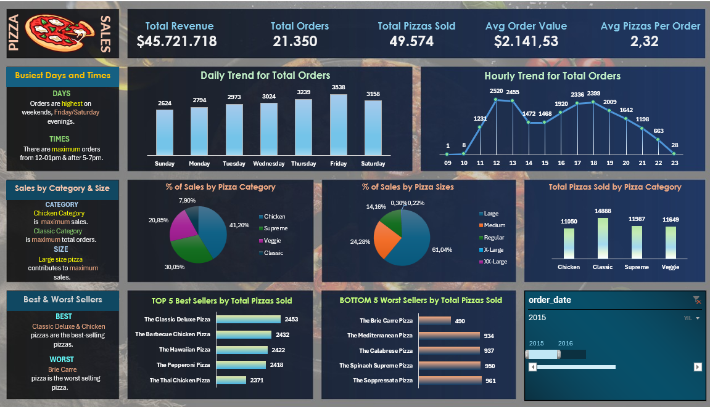

#  Pizza Sales Analysis & Interactive Dashboard

An end-to-end data analysis project exploring pizza sales performance using **MS SQL Server** for data querying and aggregate metrics, and **Microsoft Excel** for interactive visual dashboard reporting.

---

## Dashboard Preview

---

##  Project Overview
This project analyzes sales data from a pizza restaurant chain to uncover key performance metrics, sales trends, category distribution, and top/bottom seller items. The goal is to provide actionable business insights to optimize products, marketing strategies, and planning.

---

##  Tools & Technologies
* **MS SQL Server:** Data extraction, KPI aggregation, time trend analysis (`DATENAME`, `DATEPART`), data type casting, and filtering.
* **Microsoft Excel:** Pivot Tables, Pivot Charts, Slicers, Custom Formatting, and Interactive Dashboard Design.

---

##  Key Performance Indicators (KPIs)
Based on the SQL query results:
* **Total Revenue:** $45,721,178
* **Average Order Value:** $2,141.53
* **Total Pizzas Sold:** 49,574
* **Total Orders:** 21,350
* **Average Pizzas Per Order:** 2.32

---

##  Key Insights & Sales Analysis

### 1. Order Trends & Peak Hours
* **Daily Trend:** Highest order volumes occur on **Friday** (3,538 orders) and **Thursday** (3,239 orders).
* **Hourly Trend:** Peak order times are during lunch hours (**12:00 PM – 1:00 PM**) and evening dinner hours (**5:00 PM – 6:00 PM**).

### 2. Category & Size Breakdown
* **Top Category by Quantity:** **Classic** pizza has the highest sales quantity (**14,888**)
* **Top Category by Revenue:** **Chicken** category has the highest percentage (**41.20%**), closely followed by **Supreme** (**30.05%**).
* **Top Pizza Size:** **Large (L)** size pizzas dominate sales, accounting for **61.04%** of total revenue, followed by **Medium (M)** size at **24.28%**.

### 3. Top & Bottom Performers
* **Top 5 Best Sellers (by Quantity):**
  1. The Classic Deluxe Pizza (2,453)
  2. The Barbecue Chicken Pizza (2,432)
  3. The Hawaiian Pizza (2,422)
  4. The Pepperoni Pizza (2,418)
  5. The Thai Chicken Pizza (2,371)
* **Bottom 5 Worst Sellers (by Quantity):**
  1. The Brie Carre Pizza (490)
  2. The Mediterranean Pizza (934)
  3. The Calabrese Pizza (937)
  4. The Spinach Supreme Pizza (950)
  5. The Soppressata Pizza (961)

